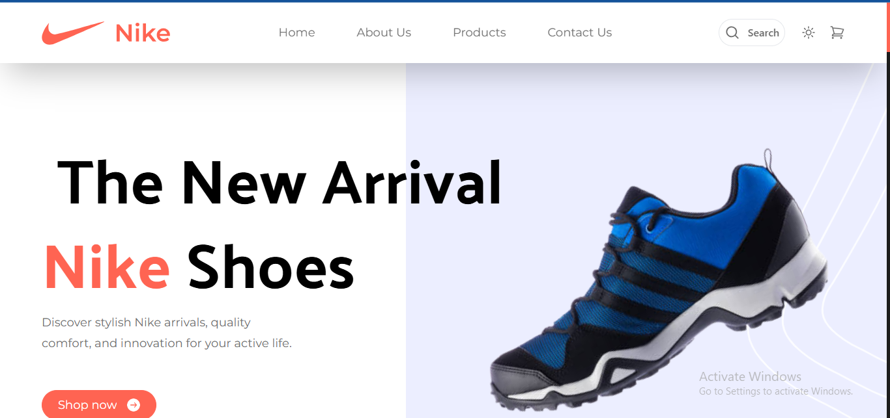
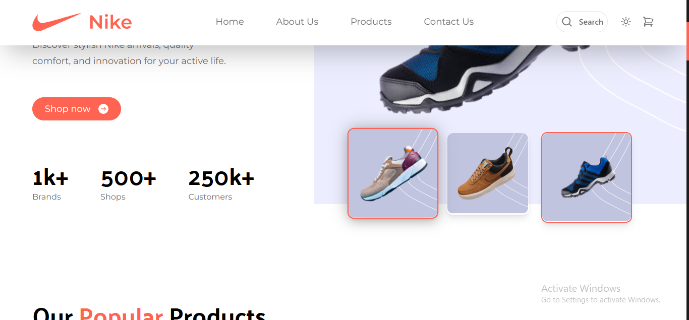
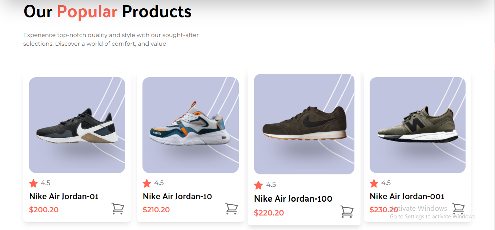
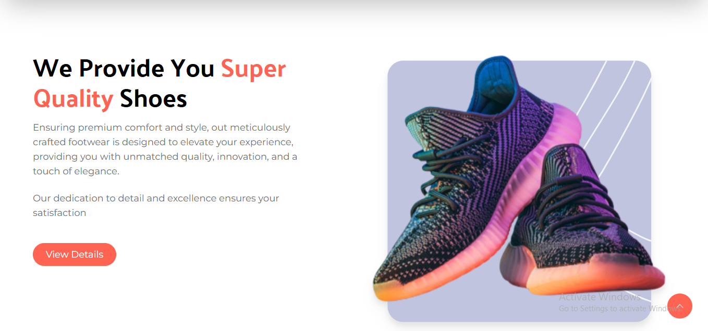
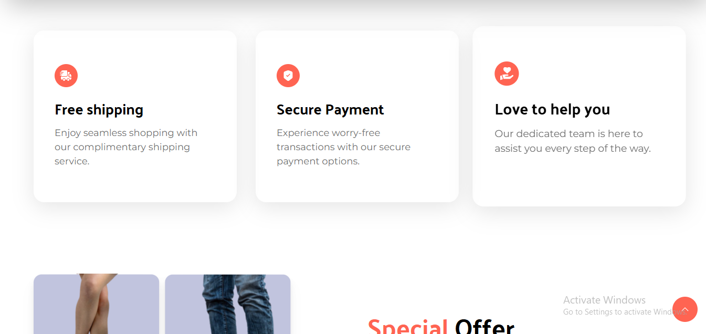
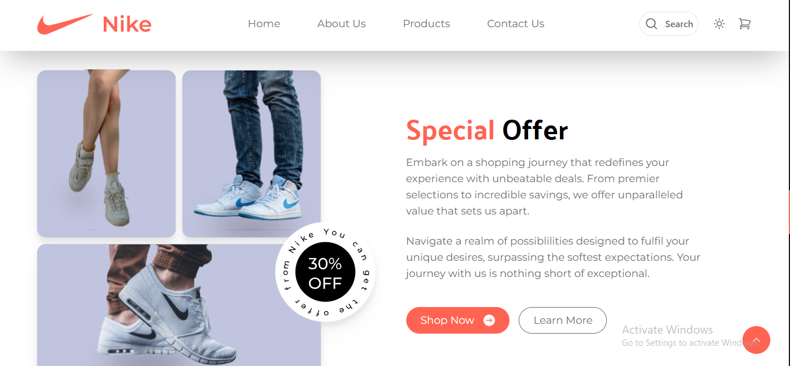
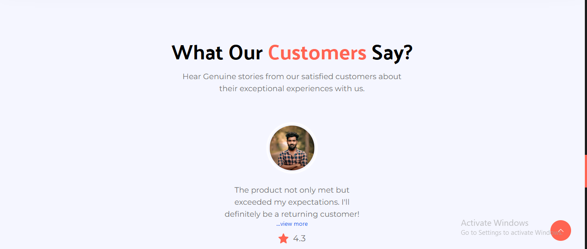
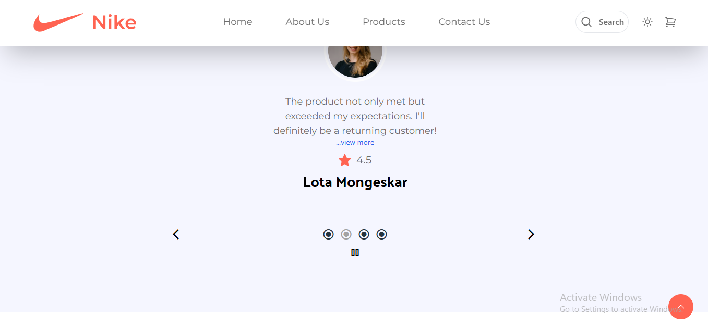
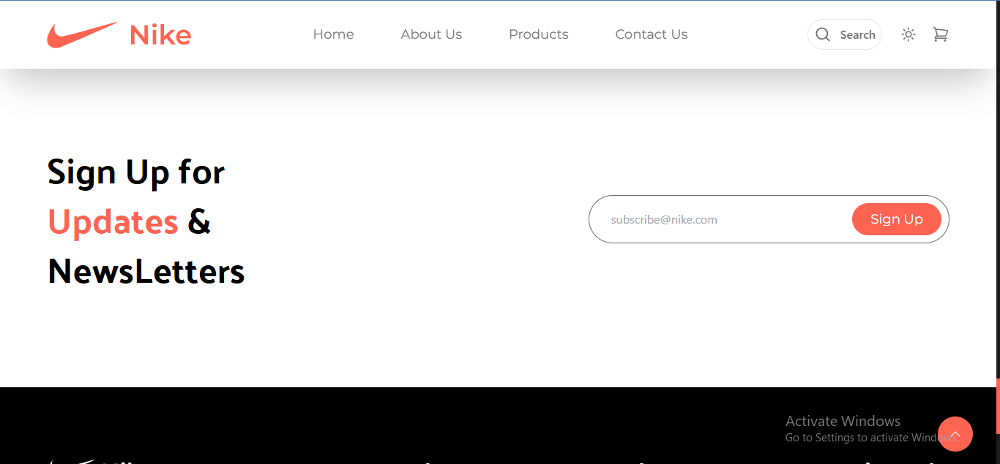
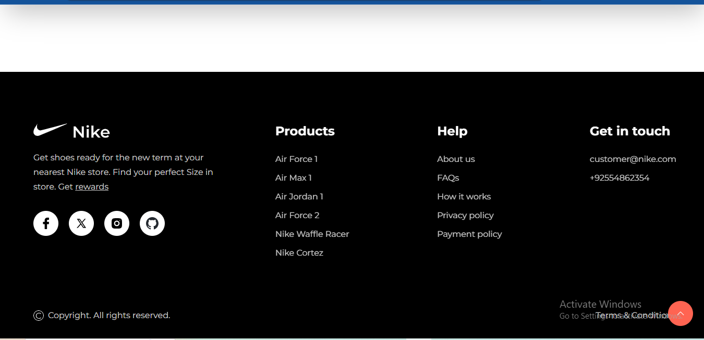

# Nike Landing Page 🏃‍♂️👟

A sleek and modern landing page inspired by Nike, designed to showcase products with style and functionality. Built using **Next.js** and **TailwindCSS**, this fully responsive landing page delivers a smooth user experience with a visually appealing design.

---

## 🚀 Features

- **Modern Design**: Inspired by Nike's iconic branding, featuring a clean, bold aesthetic.
- **Responsive Layout**: Perfectly optimized for desktops, tablets, and mobile devices.
- **Fast Performance**: Built with Next.js for lightning-fast navigation.
- **Custom Styling**: Tailored with TailwindCSS for pixel-perfect designs.
- **Interactive Elements**: Hover effects and dynamic components for enhanced user engagement.

---

## 🛠️ Tech Stack

- **Frontend**: Next.js, TailwindCSS  
- **Styling**: Customizable styles powered by Tailwind's utility-first framework  

---

## Screenshots of the project

Below are screenshots of the application in action:












---

## ⚙️ Installation

1. Clone the repository:

   ```bash
   git clone https://github.com/sanjit961/nike.git
   ```

2. Navigate to the project directory:

   ```bash
   cd nike-landing-page
   ```

3. Install dependencies:

   ```bash
   npm install
   ```

4. Run the development server:

   ```bash
   npm run dev
   ```
---

## 🎨 Customization

- **Tailwind Config**: Modify the `tailwind.config.js` file for custom themes and colors.
- **Components**: Update the reusable components in the `components/` folder for additional functionality.

---

## 🤝 Contribution

Contributions are welcome! Feel free to fork the repository, make your changes, and submit a pull request.

---

## 📄 License

This project is licensed under the **MIT License**.

---

⭐ **Show your support by starring this project!**
